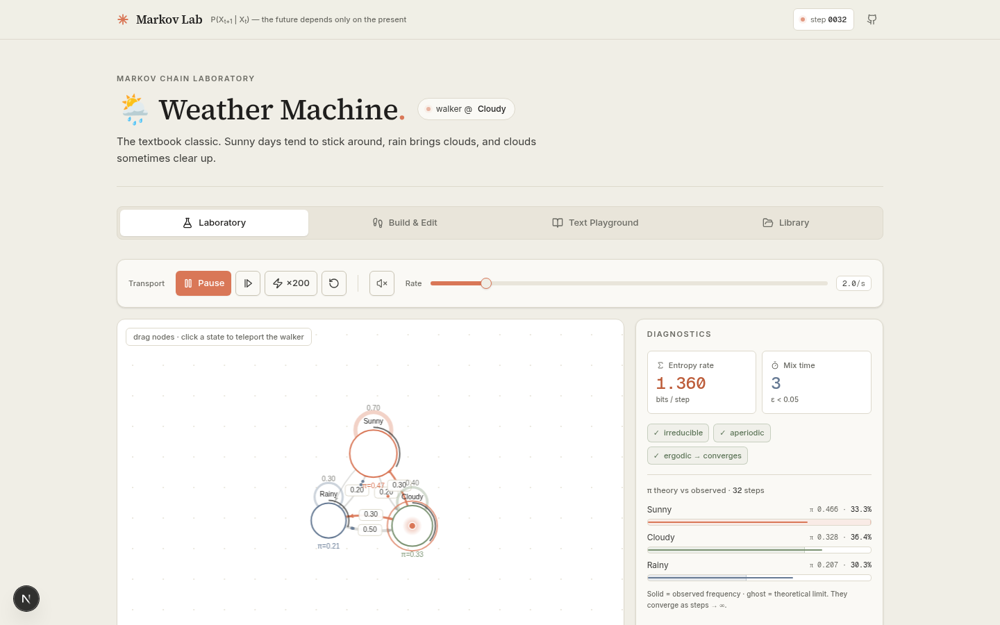
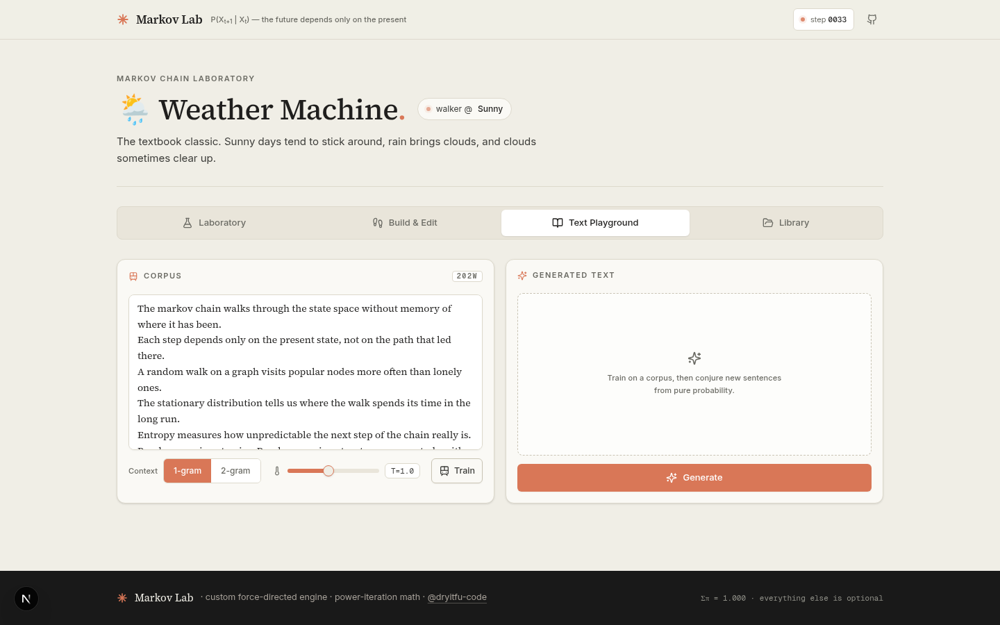

# ⛓️ Markov Lab

**An interactive Markov chain laboratory** — build, simulate and dissect stochastic processes in your browser.

> The future is independent of the past, given the present. — the Markov property




## ✨ Features

### 🧪 Laboratory
- **Custom force-directed graph engine** (canvas, zero graph libraries) — state nodes sized by stationary probability on a white paper bed with a warm dot grid, curved probability-weighted ink edges with arrowheads, live particle flows, self-loops
- **Live random-walk simulation** — a clay walker orb hops between states in real time; drag nodes, click any state to teleport the walker
- **Real-time diagnostics** — stationary distribution (power iteration), entropy rate in bits/step, mixing time (ε=0.05), irreducibility / aperiodicity / absorbing-state detection
- **Convergence analytics** — exact `e₀·Pᵏ` evolution chart with total-variation distance to π, plus empirical frequencies overlaying theory as steps accumulate

### 🛠️ Build & Edit
- Editable transition matrix with live row-sum validation + one-click normalization
- Add / remove / rename states (2–10 states), everything recomputes live

### 📖 Text Playground
- Order-1 / order-2 word-level Markov text generator with temperature sampling
- Train on any corpus, generate gloriously weird new sentences

### 📚 Library
- 8 preset models: Weather Machine, Gambler's Ruin, Mini PageRank, DNA Mutator, Elevator Dispatch, Melody Walker, Coder's Mood, M/M/1 Queue
- Save your own chains to SQLite (Prisma) — full CRUD via `/api/chains`

## 🧮 The math

| Concept | Method |
|---|---|
| Stationary distribution π | Power iteration to 1e-12 tolerance |
| Distribution after k steps | `e₀·Pᵏ` via matrix exponentiation by squaring |
| Entropy rate | `H = −Σᵢⱼ πᵢPᵢⱼ log₂ Pᵢⱼ` |
| Mixing time | smallest k with `‖e₀Pᵏ − π‖_TV < 0.05` |
| Periodicity | GCD of return-path lengths (BFS) |
| Irreducibility | Graph reachability BFS |

## 🏗️ Tech stack

- **Next.js 16** (App Router) · **TypeScript** strict
- **Zustand** for chain/simulation state
- **Recharts** for convergence analytics
- **Prisma + SQLite** for chain persistence
- **Tailwind CSS 4** + custom paper-and-ink design tokens (8 hand-rolled ui primitives)
- **sonner** for toasts, styled to match
- Custom canvas physics engine (repulsion + springs + centering)

## 🎨 Design system — paper & ink

A flat, editorial identity: warm ivory surfaces, warm ink text, 1px tan hairlines, and a single clay accent. Serif for display & reading (Source Serif 4), sans for UI (Inter), mono for numerals. No glow, no glass.

| Token | Hex | Use |
|---|---|---|
| `--background` | `#F0EEE6` | ivory page |
| `--card` / `--paper` | `#FAF9F5` | paper cards |
| `--primary` / `--clay` | `#D97757` | the one accent |
| `--ink` | `#1F1E1D` | primary text |
| `--border` / `--hairline` | `#DDD9CC` | 1px hairlines |

All tokens live in [`src/app/globals.css`](src/app/globals.css); the clay starburst mark is both the favicon ([`src/app/icon.svg`](src/app/icon.svg)) and the header glyph.

## 🚀 Run it

```bash
bun install
bun run db:push
bun run dev
```

---
Built as a gift for [@dryitfu-code](https://github.com/dryitfu-code) — whose `markov_chain_models` repo was *too* empty. 😄
